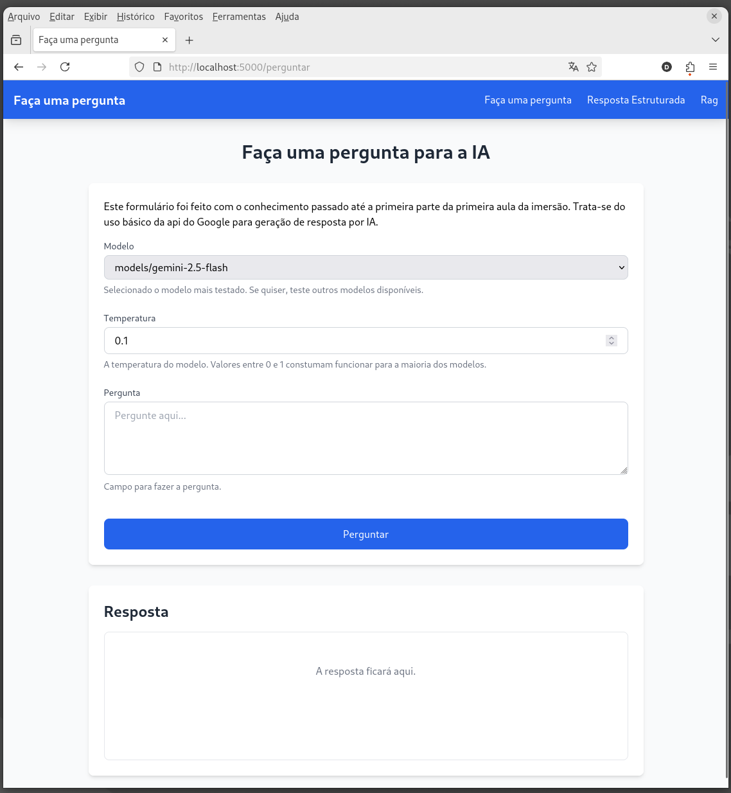

# Exercício Imersão DEV Alura - Agentes de IA com Gemini

* [Carta de intenções](#carta-de-intenções)
* [Subindo ambiente](#subindo-o-ambiente)
* [Recursos](#recursos)

## Carta de intenções

A Imersão DEV Agentes de IA da Alura, iniciada no dia 08 de Setembro de 2025, tinha como objetivo mostrar as tecnicas vigentes para a criação de agentes de AI para profissionais de qualquer nível e qualquer carreira.

Participei seguindo o passo-a-passo, mas como já um profissional há diversos anos na carreira de desenvolvedor, decidi refazer os passos da imersão de forma *apimentadata*.

Seguem os temperos:

### ESTOU PROIBIDO DE USAR O GOOGLE COLAB

Depender de serviçose de terceiros para prover as soluções é algo que me incomoda um pouco. Entendo que se basear em um provedor de serviço externo é uma estratégia para agilizar processos pela grande conveniência que eles entregam, mas convenhamos que as pessoas utilizam os serviço de terceiro pela comodidade. E daí vem o problema: o provider lock-in, mudanças de políticas de acesso, limites de requisições, reajustes de preços e até a indisponibilidade do serviço por qualquer motivo que seja são problemas em potencial que uma pessoa passa ao decidir depender de provedor externo. Fora que a disciplina de manter a sua própria infraestrutura facilita no momento de disponibilizar a solução em qualquer outro provedor disponível, e novamente, não estar dependente apenas daquilo que é oferecido dentro do Google.

Entendo que como parte a proposta é utilizar o serviço do google pela sua api para ter acesso aos modelos, e neste caso, ainda estaremos dependentes do serviço do Google. Mas até isso podemos superar, já que a possibilidade de utilizar modelos rodando localmente também será explorado.

### Utilização de Docker

Em substituição do Google Colab, utilizarei um ambiente de desenvolvimento *containerizado*. Os problemas relacionados à instalação e interdependência de pacotes que existem ao cuidar da sua própria infraestrutura ensinarão disponibilizar a solução em qualquer nuvem ou mesmo em servidores on-promise.

### Interface web

Durante a Imersão, fica inconveniente testar e registrar testes e parametrizações que eventualmente o estudante queira testar.

Disponibilizar uma interface web facilita e deixa a experiência do aprendizado muito mais prazeirosa.

A interface web oferecerá mecanismos de histórico de questões, alteração do modelo a ser utilizado, possibilidade de alterar a utilização de agentes no modo completamente offline (sem depender da api e, consequentemente, de uma chave de acesso do Google), alteração de parâmetros como a temperature, e alteração dos dados para o RAG, com a possibilidade de adicionar e remover pdfs que tenham os dados a serem cosumidos pelo RAG.

### Flask

Servidor web simples, que utiliza Python. Deste modo, tem-se mais aderêcia e simplicidade ao interagir com o código criado para os agentes.

Apesar da simplicidade da proposta da imersão, o cuidado de oferecer uma interface web com todos os controles e conveniência necessário será um ótimo exercício de código limpo e padrão de projeto.

### Jinja como view

Recurso com boa aderência do Flask para o desenvolvimento das das interaces web.

### Tailwind

O framework CSS que é conhecido por facilitar muito e facilitar ao prover classes de modo a fazer o desenvolvedor não precisar criar folhas de estilos e conseguir servir templates visualmente agradáveis.

### Banco de dados relacional

A gerência e conversa com um banco de dados relacional será fundamental para guardar preferências de usuário, o histórico de perguntas e mesmo os logs para monitorar o desempenho da aplicação e da API utilizada.

### Para além do Google Gemini - mas se mantendo nos recursos gratuitos

Ferramentas como Chats de outros providers (Deepseek e ChatGPT) já estão muito comumente utilizadas no meu fluxo de desenvolvimento. Como assitente de codificação, utilizo o Amazon Q, já que diferentemente do CoPilot, até então não me foi imposto nenhum limite de uso, mesmo na versão gratuita.

## Subindo o ambiente

### Variáveis de ambiente

Depois que clonar o repositório, deve-se copiar o arquivo `.env.exemplo` para um outro arquivo chamado `.env`, substituindo as informações necessárias. Destaque para a variável `CHAVE_API_GOOGLE`, que é preciso ser gerada no Google, caso contrário não será possível acessar a api do Google.

### Compilando o ambiente

Execute o seguinte comando:
```
docker compose up --build
```
Este comando já dispara o script da receita do ambiente, que compila o ambiente, instala as dependências, faz a migration de banco de dados, baixa os modelos disponíveis pelo Google e iniciar o servidor Flask. Depois de terminar se subir o ambiente, basta acessar `http://localhost:5000`, e você verá a aplicação no ar para ser testada.



### Log

Por padrão, a aplicação mantém um arquivo na raiz chamado `app.log`. As atividades realizadas costuma escrever nesse arquivo para permitir o monitoramento.

Para acompanhar mensagens adicionais no log, sugiro abrir uma nova janela e usar o `tail -f app.log` para ver eventuais mensagens para dar informações adicionais sobre os processos internos da execução dos comandos e das atividades feitas na aplicação web.

## Recursos

### Banco de dados

Essa aplicação utiliza um banco de dados mysql para poder armazenar configurações da aplicação. Ela está disponível na porta 3306. Para mais informações sobre o banco (incluindo o acesso do mesmo), ou personalizar a porta, caso a 3306 já esteja ocupada, verifique os valores no arquivo `.env`. Pode alterar os valores e em seguida, reconstruir o ambiente docker para poder operar com os novos valores.

### Comandos

Algumas ações são possíveis a partir de comandos que podem ser executados pelo terminal.

Para executar um comando fora do container, execute o seguinte:

```
docker exec -it imersao_alura_agentes_ia_ambiente python3 comando.py --comando <o_seu_comando>
```

Dentro do container, os comandos podem ser executados da seguinte forma:
```
python3 comando.py --comando <o_seu_comando>
```

**Listando os comandos disponíveis**

```
docker exec -it imersao_alura_agentes_ia_ambiente python3 comando.py --comando ajuda
```

E uma lista de comandos possíveis será aprensentado.

**Fazendo uma pergunta**

```
docker exec -it imersao_alura_agentes_ia_ambiente python3 comando.py --comando perguntar --pergunta "Qual a capital da França?"
```

**Verificando os modelos disponíveis pelo Google**

```
docker exec -it imersao_alura_agentes_ia_ambiente python3 comando.py --comando registrar_modelos_disponiveis
```

Este comando aciona a api do Google para listar os modelos disponíveis e salva no banco de dados relacional na tabela `modelos`, e detalhes dos modelos ficam armazenados na tabela `modelos_meta_dados`.

## Lista de comandos

Segue a lista de comandos possíveis (sintaxe para execução de dentro do container):

### carregar_documentos
```
python3 -m comando --comando carregar_documentos
```
Comp parte do processo de RAG, é necessário que o código saiba carregar os documentos. Executar esse comando faz o carregamento dos documentos para o RAG.

Use `tail -f app.log` para ver informações adicionais.

### alterar_ordem_modelo
```
python3 -m comando --comando alterar_ordem_modelo --ordem 2 --modelo "models/gemini-2.5-pro"
```
Lida com o valor a ser registrado no banco de dados relacionado à ordem em que aparecem na interface da aplicação web.

A listagem de modelos obedece, primeiro, ao campo `ordem` dentro da tabela `modelos`, e em seguida, o nome do modelo. Esse é um artifício para poder alterar a ordem de exibição da listagem de modelos na interface.

Como valor de `--ordem`, utilize qualquer valor inteiro. Para o valor de `--modelo`, consulta os modelos disponíveis na tabela `modelos`.

### desenhar_grafo
```
python3 -m comando --comando desenhar_grafo
```
Como parte do exercício de testar as configurações do `langgraph`, esse comando gera uma imagem pelo método `draw_mermaid_png` de `StateGraph` (`langgraph`). Como pode-se ver na saída do comando, ele gera um arquivo na pasta `grafos`, que se trata do png demonstrado em aula.

### limpar_banco
```
python3 -m comando --comando limpar_banco
```
Durante o desenvolvimento, foi necessário fazer algumas alterações estruturais no banco de dados. E para facilitar o processo, foi criado esse comando que remove completamente o banco de dados.

### listar_perguntas_padrao
```
python3 -m comando --comando listar_perguntas_padrao
```
São as perguntas padrão disponíveis para fazer os teste de perguntas para a IA de forma mais estruturada. A saída desse comando também expõe os ids das perguntas que podem ser utilizados pelo comando `rodar_agentes`, que apenas aceita as perguntas padrões.

### rodar_agentes
```
python3 -m comando --comando rodar_agentes --id-pergunta-padrao 11
```
Este comando exige também o parâmetro `--id-pergunta-padrao`, onde se exige um id que é fornecido pelo comando `listar_perguntas_padrao`.

### migrar
```
python3 -m comando --comando migrar
```
Comando criado para facilitar o desenvolvimento. Responsável por fazer a migração do banco de dados. No startup do ambiente, ele já é rodado automaticamente e só funciona quando ainda não há um banco de dados para que a aplicação possa rodar.

## perguntar
```
python3 -m comando --comando perguntar --pergunta "Qual a composicao do nucleo do sol?"
```
Faz uma pergunta pela linha de comando.

## registrar_modelos_disponiveis
```
python3 -m comando --comando registrar_modelos_disponiveis
```
Esse comando é rodado automaticamente na compilação do ambiente. Ele foi bem útil quando ele precisava ser rodado à parte para preencher o banco de dados com os modelos disponíveis pelo Google. Ainda é interessante ver o que o Google disponibiliza em termos de api para que possamos consultar quais modelos estão disponíveis.

## renovar_banco
```
python3 -m comando --comando renovar_banco
```
Executa ao mesmo tempo o comando `limpar_banco` e `migrar`. Útil para quando se deseja renovar o banco de dados de forma mais conveniente quando houve mudança de estrutura do banco de dados.

### listar_documentos_rag
```
python3 -m comando --comando listar_documentos_rag
```
Lista todos os documentos que estarão disponíveis para serem consultados no momento que for respondida uma pergunta que considere o RAG. Repare que ele interage com as configurações feitas pela aplicação web quanto à adição de documentos adicionais e desativações dos documentos padrões.

## perguntar_com_rag
```
python3 -m comando --comando perguntar_com_rag --pergunta 'Posso pedir reembolso em gastos de viagens?'
```
Faz uma pergunta pela linha de comando considerando o RAG. Repare que é necessário parâmetro adicional `--pergunta` e em seguida munir com a pergunta em si. Ele responde com o formato cheio mostrado na imersão.

## ver_chunks_documentos
```
python3 -m comando --comando ver_chunks_documentos
```
Carrega os documentos para RAG e exibe os fragmentos que são analisados pela IA para a resposta.

